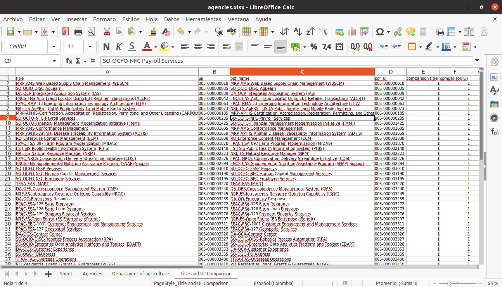

# Results Report - RPA Challenge - IT Dashboard

## Index
- [Previous Information](#previous-information)
- [Local VS CodeVisual Studio](#local-vs-codeVisual-studio)
    - [Run Robot](#run-robot)
    - [Get a list of agencies](#get-a-list-of-agencies)
    - [Select one of the agencies](#select-one-of-the-agencies)
    - [Agency Individual Investments](#agency-individual-investments)
    - [Business Case](#business-case)
    - [PDF Business Case and Excel Agency Investment Comparison](#pdf-business-case-and-excel-agency-investment-comparison)
    - [Output Files](#output-files)
- [Robocloud](#robocloud)
    - [Robots](#robots)
    - [RPA Challenge - IT Dashboard](#rpa-challenge---it-dashboard)
    - [Processes](#processes)
    - [Process rpa-challange-it-dashboard](#process-rpa-challange-it-dashboard)
    - [Configure Process - Environment Variables](#configure-process---environment-variables)
    - [Work Data Explorer](#work-data-explorer)
    - [Process run](#process-run)
    - [Results](#results)
    - [Artifacts (Outputs)](#artifacts-outputs)
        - [Excel File - Agencies](#excel-file---agencies)
        - [Excel File - Agency Individual Investments](#excel-file---agency-individual-investments)
        - [Business Case PDF](#business-case-pdf)
        - [Compare PDF Business Case and Excel Agency Investment](#compare-pdf-business-case-and-excel-agency-investment)

## Previous Information
To understand the development, you must previously access the following links:
- [RPA Challenge - IT Dashboard](https://thoughtfulautomation.notion.site/RPA-Challenge-IT-Dashboard-ec59bc2659e64323a7af99fcd4d24c21)
- [Robot structure & configuration](https://robocorp.com/docs/setup/robot-structure)
- [RPA Development Environment](https://robocorp.com/docs/setup/development-environment)
- [Robocloud](https://cloud.robocorp.com/)

## Local VS CodeVisual Studio
To run the process in local you could use Visual Studio Code with Robocorp extensions or the Robocorp Lab IDE as an RPA Development Environment.

### Run Robot
Run the robot.

### Get a list of agencies
The robot will get a list of agencies, which will later save in an Excel sheet.

For this we carry out the following steps. We:

- Create (if it does not exist) an 'output' directory within which the Excel file is created.
- Create (or open if it is already created) the Excel file to save the agencies list.
- Open the [IT Dashboard](https://itdashboard.gov/).
- Wait until the __DIV IN__ button is available.
- Click on the __DIV IN__ button, which displays the list of agencies.
- Wait until the agency list is available.
- Select the _All_ option to display the completed list.
- Wait until all list is available.
- Get the agencies list with the _name_, _amount_ and _link_ fields.
- Close the website.
- Save the agencies within the Excel file.

### Select one of the agencies
Within the `env.json` file we assign the `AGENCY_NAME` to the environment variable name of the agency which we want to obtain the Individual Investments.

### Agency Individual Investments
we go to the agency (`AGENCY_NAME`) page and scrape the table with all "Individual Investments" and write it to a new sheet in excel. 

For this we carry out the following steps. We:

- Get the link of the agency indicated in the variable `AGENCY_NAME` from the Agencies sheet in the Excel file.
- Open the chosen agency website.
- Get the table with the agency individual investments in html format.
- Close the website.
- Build the final table.
- Save the table in the Excel file.

### Business Case
If the "**UII**" column contains a link, we open it and download PDF with Business Case.

For this we carry out the following steps. We:

- Get the investments from the Excel file, and filter only those that have a link.
- Set the browser so that the downloaded pdf files are stored in the 'output' directory.
- For each investment we get the link, and:
  - Open the website corresponding.
  - Wait until the link to download the pdf file is available.
  - Click to download the pdf.
  - Wait for it to be detected that the pdf begins to download.
  - Wait for the pdf to be downloaded.
  - Close the website.

#### PDF Business Case and Excel Agency Investment Comparison
We extract "Name of this Investment" and "Unique Investment Identifier (UII)" and compare this values with the columns "Investment Title" and "UII" in Excel, and save the comparison in the Excel file.

For this we carry out the following steps. We:

- Get a list with columns title and uii of business cases from the Excel file.
- Get a list of the PDFs stored in the output directory ordered by date.
- Get the text inside the first page of a pdf file.
- Extract the Name and UII from a PDF text
- Compare the name and uii keys of the pdf file list with the title and uii keys of the excel list, and insert another key with the comparison.  
- Save the comparison in the Excel file.

### Output Files
All files are store in the _output_ directory.

## Robocloud

### Robots

In [Robocloud](https://cloud.robocorp.com/), we create a robot with name _RPA Challenge - IT Dashboard_ uploading a .zip file including with the project.

[Go to the web page](https://cloud.robocorp.com/thefunctionaryfxi1h/luisjimenez/robots/12268)

### RPA Challenge - IT Dashboard
We can edit the project using the _Edit online_ option.

[Go to the web page](https://cloud.robocorp.com/thefunctionaryfxi1h/luisjimenez/robots/12268/edit)

### Processes
We create a process with name _rpa-challenge-it-dashboard_, and include the robot.

[Go to the web page](https://cloud.robocorp.com/thefunctionaryfxi1h/luisjimenez/processes)

### Process rpa-challange-it-dashboard

We link on the process.

[Go to the web page](https://cloud.robocorp.com/thefunctionaryfxi1h/luisjimenez/processes/88ad44ae-3fc1-4d3d-ab1c-b87d77c35e85)

### Configure Process - Environment Variables

We link on the option _Configure Process_, select _Show advanced_ and set the environment variable *AGENCY_NAME*.

[Go to the web page](https://cloud.robocorp.com/thefunctionaryfxi1h/luisjimenez/processes/88ad44ae-3fc1-4d3d-ab1c-b87d77c35e85#configure)

### Work Data Explorer

We _Run_ the process. Select _RPA Challenge - IT Dashboard ▸ Run Python_ and see all processes running.

[Go to the web page](https://cloud.robocorp.com/thefunctionaryfxi1h/luisjimenez/processes/88ad44ae-3fc1-4d3d-ab1c-b87d77c35e85?explorer=eyJzY29wZSI6InByb2Nlc3MiLCJwSWQiOiI4OGFkNDRhZS0zZmMxLTRkM2QtYWIxYy1iODdkNzdjMzVlODUiLCJmaWx0ZXJzIjp7ImMwMjAxNjgwLWMyMzMtNGMyZS05NmQ4LWIyNzU4ZjVjMmEwMCI6WyJOIiwiUCIsIkkiLCJGIiwiQyJdfX0%3D)

### Process run

We select _Run #_ and the _Step runs_ to see the results.

[Go to the web page](https://cloud.robocorp.com/thefunctionaryfxi1h/luisjimenez/processes/88ad44ae-3fc1-4d3d-ab1c-b87d77c35e85/runs/30695b33-a3a2-4562-a0cc-effbeb2c3f5e)

### Results

[Go to the web page](https://cloud.robocorp.com/thefunctionaryfxi1h/luisjimenez/processes/88ad44ae-3fc1-4d3d-ab1c-b87d77c35e85/runs/30695b33-a3a2-4562-a0cc-effbeb2c3f5e/stepRuns/0438de83-0e34-41f9-8ea8-c7b6e38d6d2f)

### Artifacts (Outputs)

#### Excel File - Agencies

#### Excel File - Agency Individual Investments

#### Business Case PDF

#### Compare PDF Business Case and Excel Agency Investment

